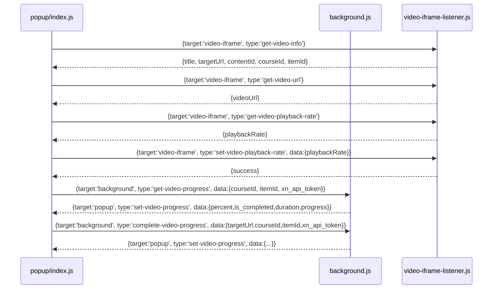

# Hack LMS

`Hack LMS`는 SSU LMS(Canvas) 환경에서 동영상 강의 정보를 조회하고 다운로드/배속/진행률 조작을 돕기 위한 Chrome 확장 프로그램입니다.

> **중요:** 이 프로그램을 사용해서 발생하는 모든 불이익은 사용자 본인의 책임입니다. 학교 정책, 강의 이용 약관, 네트워크 보안 규칙 등을 반드시 확인하세요.

## 개요

이 확장은 세 가지 주요 컴포넌트로 구성됩니다:

- `popup`: 확장 UI, 사용자 조작 입력 처리
- `background`: Canvas API 호출과 진행률 조작 처리
- `content script` (`video-iframe-listener.js`): video iframe 내부에서 비디오 요소를 제어

이 확장은 도메인이 다른 비디오 iframe을 직접 접근할 수 없기 때문에, `content script`를 이용해 메시지 기반으로 iframe 내부를 제어하는 구조를 사용합니다.

## 동작 원리

### 학습 완료시키기 기능

1. 사용자가 팝업에서 `학습 완료` 버튼을 클릭한다.
2. `popup/index.js`는 현재 동영상 정보를 `video-iframe` content script에 요청하여 `targetUrl`, `courseId`, `itemId`를 가져온다.
3. `popup`은 `background`에 `complete-video-progress` 메시지를 보내고, `background.js`는 Canvas API를 사용해 강의 진행 상태를 반복적으로 갱신한다.
4. `background.js`는 `set-video-progress` 메시지로 팝업에 진행률을 전달하여 상태 표시를 업데이트한다.

### 동영상 다운로드

1. 팝업이 열리면 `popup/index.js`는 content script에 `get-video-url` 메시지를 보낸다.
2. content script(`video-iframe-listener.js`)는 video iframe 내부의 비디오 요소를 찾아 실제 MP4 URL을 반환한다.
3. 팝업은 이 URL을 받아 다운로드 버튼에 연결하고, 사용자가 클릭하면 `chrome.downloads.download` API로 파일을 저장한다.

### 배속 설정 기능

1. 팝업은 content script에 `get-video-playback-rate`를 요청하여 현재 재생 속도를 가져온다.
2. 사용자가 슬라이더를 변경하면 `set-video-playback-rate` 메시지가 content script에 전송된다.
3. content script는 iframe 내부의 비디오 요소를 찾아 `video.playbackRate`를 조정하고 필요한 경우 관련 이벤트를 제어한다.

### 왜 이렇게 구성했는가?

- `popup`은 현재 탭의 `canvas.ssu.ac.kr` 페이지에서 실행된다.
- 실제 동영상 iframe은 `commons.ssu.ac.kr/em/*` 도메인에서 로드된다.
- 브라우저 동일 출처 정책(SOP) 때문에 도메인이 다른 iframe에 popup이 직접 접근할 수 없다.
- 그래서 content script를 `commons.ssu.ac.kr/em/*` 페이지에 삽입하고, popup은 메시지를 통해 해당 iframe 내부를 간접 제어한다.

## 구성 요소

### popup

- `popup/index.html`: UI 레이아웃
- `popup/index.js`: 현재 탭에서 토큰을 가져오고, content script와 message 교환
- 동영상 다운로드 버튼, 배속 슬라이더, 완료 처리 버튼 등을 제공

### background

- `background.js`: 확장 서비스 워커
- Canvas API 호출(`attendance_items`, `progress` 등)
- `popup`과 메시지로 통신하여 진행률 상태를 갱신하거나 완료 처리를 수행

### content script

- `video-iframe-listener.js`
- `commons.ssu.ac.kr/em/*` 도메인에서 실행
- 비디오 요소를 찾아 정보 반환, 재생 속도 조절, URL 추출
- `popup`이 직접 접근할 수 없는 iframe 내부를 대신 조작

## 메시지 전달 프로토콜

### popup ↔ content script

- popup → content script
  - target: 'video-iframe'
  - `type`: `get-video-info`, `get-video-url`, `get-video-playback-rate`, `set-video-playback-rate`
- content script → popup
  - `sendResponse(...)`로 결과 반환

### popup ↔ background

- popup → background
  - target: 'background'
  - `type`: `complete-video-progress`, `get-video-progress`
- background → popup
  - target: 'popup'
  - `type`: `set-video-progress`, `complete-video-progress-error`

## 메시지 흐름 다이어그램

## 주의 사항

- 이 확장은 학교 LMS 시스템을 우회하거나 자동화하기 위한 용도로 작성되었습니다.
- 확장 사용으로 인한 계정 정지, 서비스 이용 제한, 법적 책임 등은 모두 사용자 본인의 책임입니다.
- 반드시 개인 학습 목적과 정책 내에서만 사용하세요.

## 설치

Chrome Web Store에서 설치할 수 있습니다.

- https://chromewebstore.google.com/detail/hack-lms/ogjjhamelnijhhnfjjbpmjjjjdeebmoi

## 참고

- `manifest.json`의 `content_scripts`는 `https://commons.ssu.ac.kr/em/*` 페이지에서만 동작하도록 설정되어 있습니다.
- `popup`은 `chrome.scripting.executeScript`로 현재 탭에서 필요한 토큰을 추출합니다.
- `video iframe` 내부 도메인이 다르기 때문에, `popup`은 직접 iframe 내부의 DOM을 제어할 수 없습니다.
